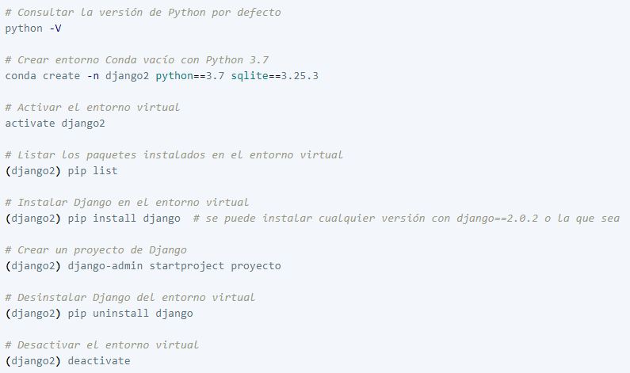
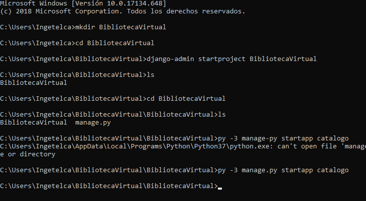

# DESARROLLO WEB
Código utilizado en desarrollo web (Front end y Back end).

# Inicializar entorno web en Django

# Inicializar App y su entorno:

# Desplegar proyecto de Django con nginx
Docs: https://medium.com/@_christopher/deploying-my-django-app-to-a-real-server-part-i-de78962e95ac
